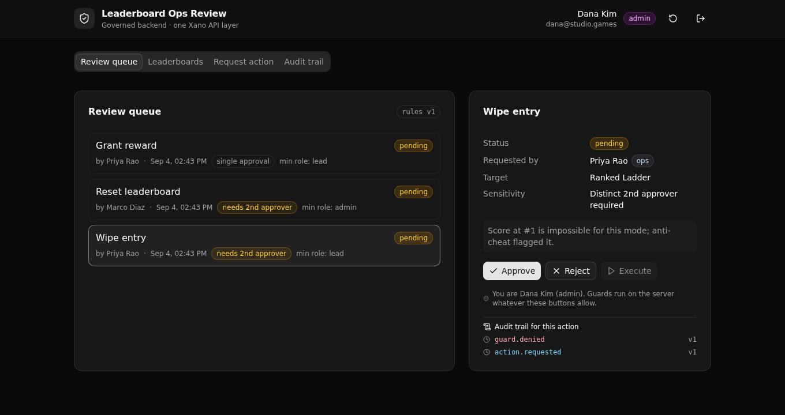

# Leaderboard Ops Review Backend

**The governed backend under an AI-built game-studio ops tool: every leaderboard action is role-routed, sensitive ones wait for a distinct second approver, and every attempt lands in an append-only audit trail, all in one Xano API layer the frontend cannot bypass.**

A fast frontend lets ops staff run sensitive actions on a game studio's live leaderboards (reset a board, wipe a cheated entry, grant a reward). The rules that keep those actions safe do not live in that frontend. They live in one versioned Xano API layer: who may act is routed by role, sensitive actions are held for a second approver from a different person, and every request, denial, approval, and execution is written to a trail that is never edited. This is the proof that a plausible AI-built internal tool becomes safe to run because the real controls sit in the backend.



**7 tables · 11 APIs · 3 functions.** Built with [XanoTS](https://www.npmjs.com/package/@xanots/sdk) (`@xanots/sdk`): a typed Xano backend under [`xano/`](xano/), and a React + Vite + Tailwind + shadcn frontend under [`frontend/`](frontend/) that derives every request path and type straight from the query defs.

## What it demonstrates

This is **Play 3: Pilot to Production** for a competitive gaming platform. It shows Xano as the governance layer that a technical evaluator (a platform director) can read and trust:

- **API-layer RBAC, never row-level security.** Access is decided by middleware and role checks at the endpoint, on the `operator` auth table plus `s.precondition` guards. Nothing about permissions is modeled in the database rows.
- **Segregation of duties.** A sensitive action needs a second approver who is not the requester. The check runs on the server, so it holds no matter what the frontend sends.
- **A versioned rule set.** Which action types are sensitive, and the minimum approver role for each, come from a single active `rule_config` row. Every decision stamps the rule version it applied, so the trail is reproducible.
- **An append-only audit trail.** Requests, guard denials, approvals, and executions are all written and never updated, each stamped with the rule version.

## Repo layout

```
xano/
├── index.ts                 the workspace, registering everything
├── tables/                  operator, leaderboard, entry, ops_action,
│                            approval, audit_log, rule_config
├── functions/               role_rank, resolve_rule, write_audit (shared logic)
├── api/groups.ts            the five API groups (pinned canonical slugs)
├── api/*.ts                 the 11 endpoints
└── xano.lock                generated identity lock (committed)
frontend/
└── src/lib/api.ts           the one contract: paths + types from the query defs
```

## API surface

| Method + path | What it enforces |
| --- | --- |
| `POST /api:lorb_auth/login` | Verifies an operator and mints a token. |
| `GET /api:lorb_auth/me` | The current operator and role (feeds the frontend gating). |
| `POST /api:lorb_ops/action_request` | Validates the target, derives sensitivity from the rule set, writes `pending` plus an audit row. |
| `GET /api:lorb_ops/actions_queue` | The review queue, the operator directory, and the active rule version. |
| `GET /api:lorb_ops/action_detail/{ops_action_id}` | One action with its requester, target, and approval rows. |
| `POST /api:lorb_ops/action_approve` | Role guard AND the segregation-of-duties guard. A denial is audited before it refuses. |
| `POST /api:lorb_ops/action_execute` | Applies the effect only if approved, the role fits, and (for sensitive types) a distinct approver signed off. |
| `GET /api:lorb_boards/leaderboards_list` | All boards with status and entry count. |
| `GET /api:lorb_boards/entries_list` | Ranked entries for a board, with the cheat flag. |
| `GET /api:lorb_audit/audit_query` | The audit trail, filterable, every row stamped with its rule version. |
| `POST /api:lorb_seed/seed_run` | Idempotent demo seed (add `force` to reset). |

## Quick start

Clone it, deploy it, and you have a live governed backend plus its frontend on a disposable Xano environment.

```bash
git clone https://github.com/xano-scratch/leaderboard-ops-review-backend.git
cd leaderboard-ops-review-backend
npm install
npx xanots login        # one-time browser auth with your Xano account
npm run xano:deploy     # builds the frontend, deploys, prints the live URL
```

Open the printed frontend URL and sign in with a demo operator (password `password123`):

- `priya@studio.games` (ops)
- `marco@studio.games` (lead)
- `dana@studio.games` (admin)

The app seeds itself on first sign-in, so the queue and the audit trail are populated right away. Try approving your own request, or approving below the required role: the API refuses it and writes the denial to the trail.

## FAQ

**Where do the permissions live?** In the API layer. Each protected endpoint names the `operator` auth table and runs role and segregation-of-duties checks with `s.precondition`. There is no row-level security.

**How is a "sensitive" action decided?** From the single active `rule_config` row. It sets which types are sensitive and the minimum approver role per type. Change that row and the whole policy changes, with the version stamped on every decision.

**Why can the frontend not skip a guard?** The guards run inside the endpoints. The frontend only sends a request. Whatever a button allows, the server still checks the role, the distinct approver, and the status before it changes any game state.

**Is the live environment permanent?** No. `xanots deploy` targets a disposable environment that expires. Re-deploy any time for fresh links.

## xano.lock, commit it

`xano/xano.lock` is generated by export and deploy. It pins each object's identity and public URLs, so a later rename stays a rename instead of a delete and recreate. It is committed on purpose. Do not edit it by hand.
